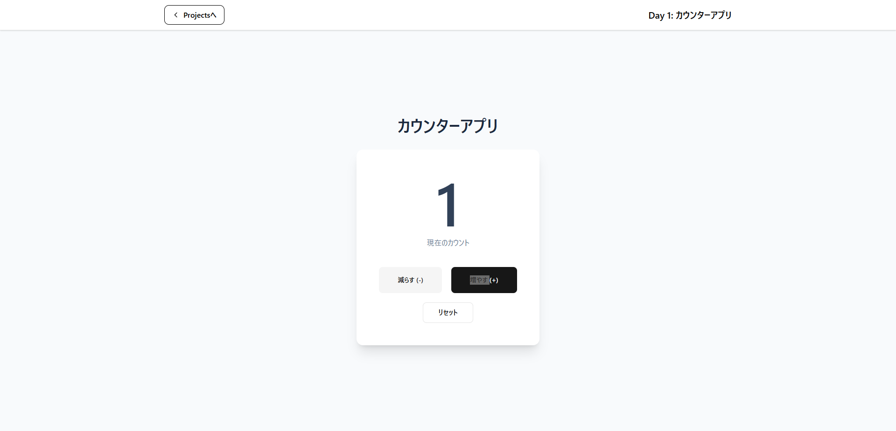
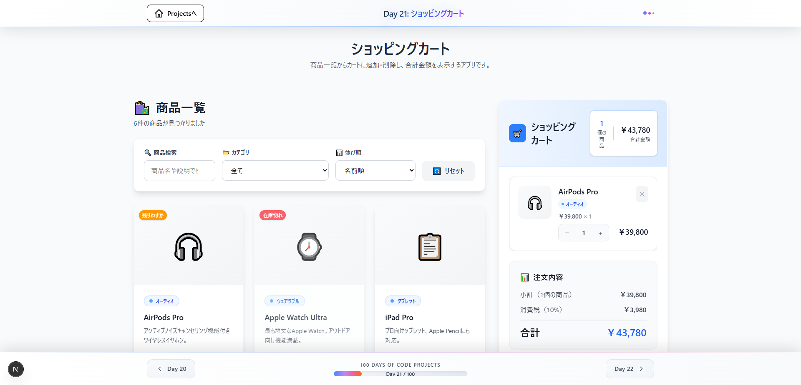
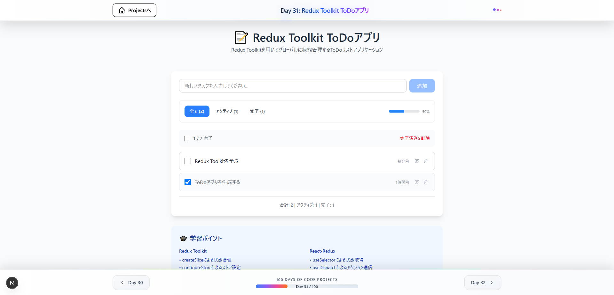
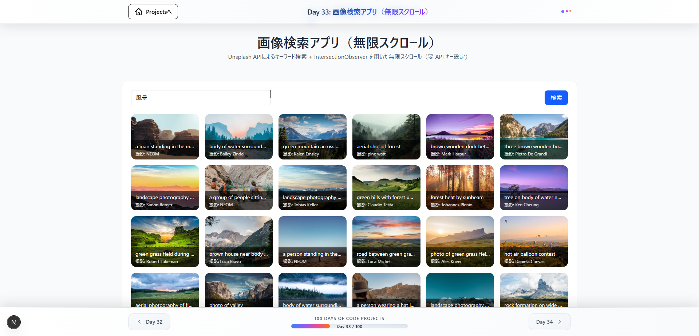
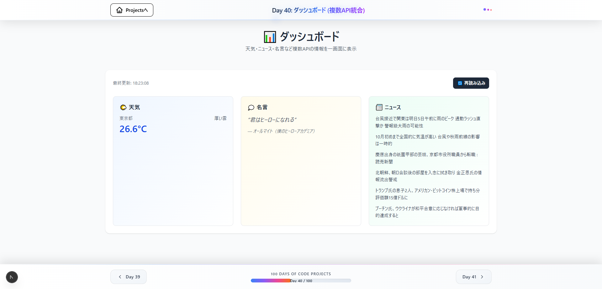

# 100 Days Of Code Projects

モダンなフロントエンド技術（Next.js, React, TypeScript, Tailwind CSS）を中心に、100日間で毎日1つの小さなアプリを作って学習するプロジェクトです。各日ごとに学習テーマを設定し、UI/UX・状態管理・API連携・パフォーマンス・PWA などを段階的に習得します。

- ライブデモ: [https://100-days-of-code-delta.vercel.app/](https://100-days-of-code-delta.vercel.app/)

---

## 概要
- 目的: React / Next.js（App Router）/ TypeScript / Tailwind CSS の実践力習得
- スコープ: 100日間、毎日1つのミニアプリを作成（Day 1〜Day 100）
- 方針: 型安全性・設計原則・ドキュメント化を重視（学習の再現性を担保）

代表例（抜粋）
- Day 21: ショッピングカート（Context/計算/複数コンポーネント連携）
- Day 31: Redux Toolkit ToDo（グローバル状態管理）
- Day 33: 画像検索（無限スクロール / IntersectionObserver）
- Day 36: QRコード生成（ダウンロード対応）
- Day 40: ダッシュボード（複数API統合 / 並列取得 / ローディング・エラー）
- Day 41〜46: GoでのAPI実装（Gin など）とNext.js連携

---

## 技術スタック（主要）
- Next.js 15.3.2（App Router）
- React 19
- TypeScript 5
- Tailwind CSS 4（ユーティリティ・ファースト）
- shadcn/ui（一部）
- Redux Toolkit / React Hook Form / Yup
- Recharts / Leaflet / QRCode
- Go（Day41-46 のサーバー実装）

package.json より（一部）
```text
next: 15.3.2
react: ^19.0.0
typescript: ^5
tailwindcss: ^4
@reduxjs/toolkit, react-hook-form, yup, recharts, leaflet, qrcode
```

---

## プロジェクト構成
```text
.
├─ public/
│  └─ images/                 # 各アプリのサムネイル画像（命名規則あり）
├─ src/
│  ├─ app/
│  │  ├─ dayX-appName/        # 各日のアプリ（page.tsx / layout.tsx / dayX.md など）
│  │  ├─ api/                 # Next.js API ルート（学習用モック含む）
│  │  ├─ layout.tsx           # ルートレイアウト
│  │  └─ page.tsx             # ホーム（全アプリ一覧 / クイックジャンプ）
│  ├─ components/
│  │  ├─ atoms|molecules|organisms|templates
│  │  └─ common/              # 共通 Header / PageHeader / Footer など
│  └─ lib/
│     └─ utils.ts
├─ server/                     # Go でのサンプルサーバー（Day41+）
├─ package.json
└─ README.md
```

---

## 開発手順
### 前提
- Node.js 18 以上（推奨: 20 系）
- npm もしくは pnpm/yarn

### セットアップ
```bash
npm install
```

### 開発サーバー
```bash
npm run dev
```

### ビルド / 本番起動
```bash
npm run build
npm start
```

### Lint / フォーマット
```bash
npm run lint
npm run format
```

---

## 新しい Day プロジェクトの追加手順（重要）
1. フォルダ作成: `src/app/dayX-app-name/` を作り、少なくとも以下を配置
   - `page.tsx`: メインページ（PageHeader は layout.tsx 側で表示するため、ヘッダーは重複禁止）
   - `layout.tsx`: 各 Day 用レイアウトに以下を必ず配置
     - `<Header title="Day XX: プロジェクト名" />`
     - `<PageHeader title="（絵文字）プロジェクト名" description="説明" />`
     - `<Footer currentDay={XX} />`
   - `dayX.md`: その日の学習ポイント・解説（丁寧に）
2. ホーム更新: `src/app/page.tsx` の `apps` 配列に新しい Day を追加
3. フッター更新: `src/components/common/Footer.tsx` の `dayRoutes` に `X: '/dayX-app-name'` を追記
4. 画像登録（必須）: `public/images/dayX-app-slug.png` を追加し、`apps[].imageUrl` に設定
   - 一時的な `'/images/no-image.svg'` のままコミットしないこと
5. 背景色の統一: 各 Day の `layout.tsx` の `<main>` に `bg-gray-50 min-h-screen` 等を設定

---

## コーディング規約（要点）
### 型安全
- `any` の使用禁止（やむを得ない場合は限定的に無効化＋理由コメント）
- 外部入力は `unknown` → Zod/型ガードで検証
- `catch (e: unknown)` を基本とし、`instanceof Error` で安全に処理

### Atomic Design
- 共有 UI は `src/components/` に集約
- 依存方向: `Pages → Templates → Organisms → Molecules → Atoms`
- shadcn/ui は Atom レイヤでラップして利用

### レイアウト規約（各 Day）
- `layout.tsx` に Header / PageHeader / Footer を必ず配置
- `page.tsx` にヘッダー（h1 等）を重複実装しない

### 画像運用
- 命名規則: `public/images/dayX-app-slug.png`
- ホームカードには必ず `imageUrl` を設定

---

## スクリーンショット（例）
> 一部抜粋。詳細はデモサイト/各 Day ページをご覧ください。

| Day | 画像 | 説明 |
| --- | --- | --- |
| 1 |  | カウンター（useState） |
| 21 |  | カート（Context/集計） |
| 31 |  | Redux Toolkit ToDo |
| 33 |  | 無限スクロール |
| 40 |  | ダッシュボード |

---

## デプロイ
- プラットフォーム: Vercel
- 本番 URL: https://100-days-of-code-delta.vercel.app/

---

## メンテナンスメモ
- 追加実装やリファクタの前に既存コンポーネントの共通化可否を確認
- 既存と重複する関数/コンポーネント/ルートがないか事前チェック
- 実装後は必ず `npm run build` でビルド確認（エラーは即時修正）

---

## ライセンス
このリポジトリは学習目的で公開しています。必要に応じてライセンスを明記してください。


