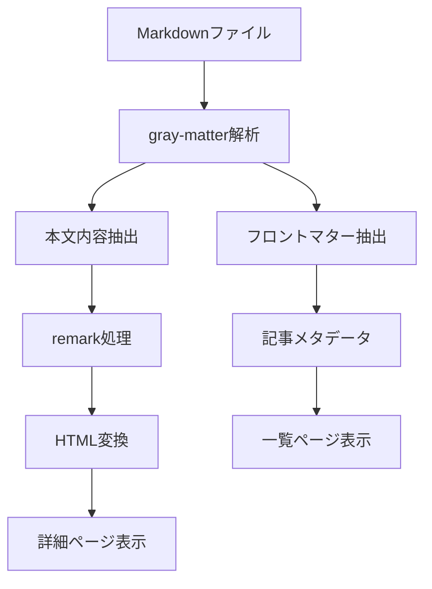

# Day 22: ブログサイト - Next.js App Routerで学ぶ静的サイト生成

## 📚 今日学んだこと

Day 22では、**Next.js App Router**を使用した静的ブログサイトを作成しました。Markdownファイルを読み込んで記事として表示し、動的ルーティングによる個別記事ページを実装することで、モダンなWebアプリケーション開発の基礎を学びました。

## 🎯 学習目標

- Next.js App Routerの基本的な使い方を理解する
- Markdownファイルの処理と表示方法を学ぶ
- 動的ルーティング（Dynamic Routing）の実装方法を習得する
- 静的サイト生成（SSG: Static Site Generation）の基本概念を理解する

## 🏗️ 実装した機能

### 1. プロジェクト基本構造
```
src/app/day22-blog-site/
├── layout.tsx          # レイアウトコンポーネント
├── page.tsx            # ブログ一覧ページ
├── [slug]/page.tsx     # 個別記事詳細ページ
├── lib/posts.ts        # Markdownファイル処理ライブラリ
├── data/               # ブログ記事（Markdownファイル）
│   ├── next-js-app-router.md
│   ├── typescript-tips.md
│   └── react-performance.md
└── day22.md           # 学習記録
```

### 2. Markdownファイル処理システム

**lib/posts.ts** では、以下の機能を実装しました：

```typescript
// Markdownファイルの読み込みと解析
export function getAllPosts(): PostMeta[] {
  const fileNames = fs.readdirSync(postsDirectory);
  const allPostsData = fileNames
    .filter((name) => name.endsWith('.md'))
    .map((fileName) => {
      const id = fileName.replace(/\.md$/, '');
      const fullPath = path.join(postsDirectory, fileName);
      const fileContents = fs.readFileSync(fullPath, 'utf8');
      const matterResult = matter(fileContents);

      return {
        id,
        title: matterResult.data.title || '',
        date: matterResult.data.date || '',
        excerpt: matterResult.data.excerpt || '',
      };
    });

  // 日付順にソート
  return allPostsData.sort((a, b) => a.date < b.date ? 1 : -1);
}
```

### 3. ブログ一覧ページ

**page.tsx** では、記事の一覧表示機能を実装：

- 📝 **記事カード形式**の見やすいレイアウト
- 📅 **日付表示**と **記事タイトル**
- 📖 **記事概要**（excerpt）の表示
- 🔗 **個別記事へのリンク**

### 4. 動的ルーティング詳細ページ

**[slug]/page.tsx** では、以下の機能を実装：

```typescript
// 静的パス生成（ビルド時に全記事のパスを生成）
export async function generateStaticParams() {
  const paths = getAllPostIds();
  return paths.map((path) => ({
    slug: path.params.slug,
  }));
}

// 記事データの取得と表示
export default async function BlogPostPage({ params }: BlogPostPageProps) {
  const post = await getPostData(params.slug);
  // ...
}
```

## 🔧 使用した技術とライブラリ

### 1. Markdownパース関連
- **gray-matter**: Markdownファイルのフロントマター（YAML形式のメタデータ）を解析
- **remark**: MarkdownをHTMLに変換する処理ライブラリ
- **remark-html**: remarkのHTML出力プラグイン

### 2. Next.js App Router機能
- **動的ルーティング**: `[slug]` フォルダによるパラメータベースルーティング
- **generateStaticParams**: 静的サイト生成用のパス事前生成
- **ファイルシステムルーティング**: フォルダ構造によるURL自動生成

## 🎨 UIとスタイリング

### カード型レイアウト
```typescript
<article className="bg-white rounded-lg shadow-md hover:shadow-lg transition-shadow duration-200 overflow-hidden">
  <div className="p-6">
    <time className="text-sm text-gray-500">
      {formattedDate}
    </time>
    <h2 className="text-xl font-semibold text-gray-900 mb-3 hover:text-blue-600 transition-colors">
      <Link href={`/day22-blog-site/${post.id}`}>
        {post.title}
      </Link>
    </h2>
    <p className="text-gray-600 mb-4 leading-relaxed">
      {post.excerpt}
    </p>
  </div>
</article>
```

### レスポンシブデザイン
- **コンテナ**: `max-w-4xl mx-auto` で適切な最大幅設定
- **余白管理**: Tailwind CSSのスペーシングシステム活用
- **ホバー効果**: カードとリンクに滑らかなトランジション

## 📊 データフロー



## 💡 学んだ重要概念

### 1. 静的サイト生成（SSG）のメリット
- ⚡ **高速な表示**: ビルド時にHTMLが生成済み
- 🔍 **SEO最適化**: サーバーサイドレンダリングによる検索エンジン対応
- 💰 **低コスト**: CDNで静的ファイル配信が可能

### 2. App Routerの設計思想
- 📁 **ファイルシステムベース**: フォルダ構造がそのままルーティングに
- 🔄 **Server Componentsファースト**: デフォルトでサーバーサイド実行
- 🎯 **レイアウト設計**: ネストした layout.tsx によるページ構造管理

### 3. Markdownエコシステム
- 📝 **フロントマター**: YAMLヘッダーによるメタデータ管理
- 🔄 **unified.js**: Markdownテキスト処理の標準ライブラリ群
- 🎨 **カスタマイズ性**: remarkプラグインによる機能拡張

## 🚀 これからの発展可能性

### 短期的な改善
- 🏷️ **タグ機能**: 記事のカテゴリ分類
- 🔍 **検索機能**: タイトルや内容での記事検索
- 📱 **モバイル最適化**: レスポンシブデザインの更なる改善

### 長期的な発展
- 💬 **コメント機能**: 読者との交流システム
- 👤 **作者システム**: 複数ライターに対応
- 🗃️ **CMS連携**: HeadlessCMSとの統合

## 🎯 今日の成果

✅ Next.js App Routerの基本的な使い方をマスター  
✅ Markdownファイルの読み込みと表示システムを構築  
✅ 動的ルーティングによる柔軟なURL設計を実装  
✅ 静的サイト生成の基礎概念を理解  
✅ モダンなブログシステムの基盤を完成

## 📝 感想

Next.js App Routerの強力さを実感できた一日でした。特に、ファイルシステムベースのルーティングと静的サイト生成の組み合わせは、従来のWebサイト開発に比べて非常に効率的で、開発者体験が大幅に向上していることを感じました。

Markdownファイルを使ったコンテンツ管理は、技術ブログや文書サイトには最適な方法だと思います。gray-matterとremarkの組み合わせにより、複雑な処理を簡潔に実装できました。

明日は暗号通貨価格表示アプリでSSR（サーバーサイドレンダリング）について学ぶ予定です。今日のSSGと合わせて、Next.jsの持つ多様なレンダリング戦略について理解を深めていきたいと思います。 